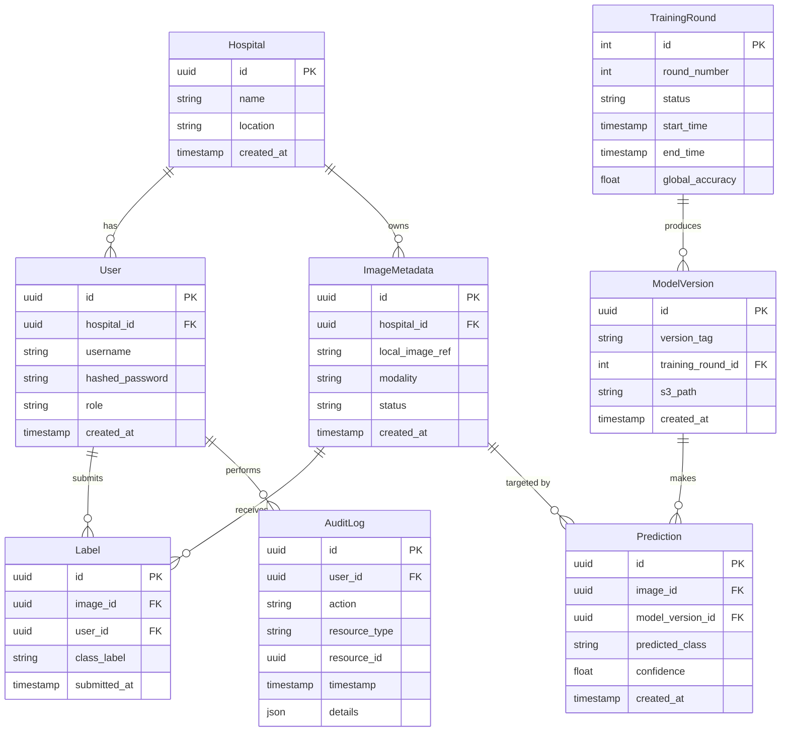

# MedShield-FL Database Schema

This document outlines the PostgreSQL database schema for the MedShield-FL central server. 
The database is designed to store metadata regarding hospitals, training rounds, models, and predictions, while strictly avoiding the central storage of raw patient data, in alignment with our privacy-preserving architecture.

## Entity-Relationship Diagram (ERD)

## Schema Details

### Primary Keys
- All tables use **UUID (UUIDv4)** for primary keys (`id`), EXCEPT for the `TrainingRound` table, which uses an **auto-incrementing integer** (`id`) to allow for sequential tracking of rounds easily.

### Privacy & Data Locality Constraints
- **No Raw Images**: The `ImageMetadata` table deliberately excludes any `bytea` or BLOB data columns. Images are referenced by a string (`local_image_ref`), representing the image's location or identifier within the local hospital's secure environment. The central server has no access to the image pixels.

### Relationships
- **Hospital - User**: One hospital can have multiple users (admins, doctors, operators).
- **Hospital - ImageMetadata**: A hospital registers metadata for its images to be part of active learning or inference pools.
- **TrainingRound - ModelVersion**: A training round produces model versions (often a single global model per round).
- **ImageMetadata - Label**: An image can receive labels (from doctors) which flow into the Active Learning loop.
- **ImageMetadata - Prediction**: Predictions are made on specific images using specific model versions.
- **User - AuditLog**: Important user actions are tracked in the audit log for compliance.
